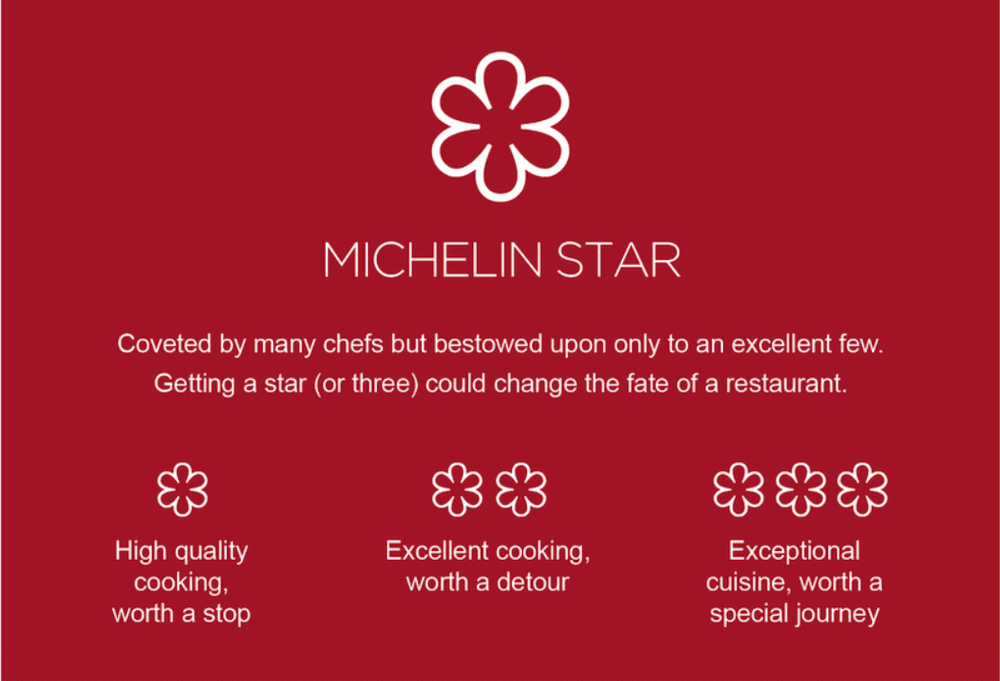

&nbsp;

&nbsp;

## **About the Project** 

 Michelin stars are what every chef is looking for! Even the most renowned chefs will be worried about losing stars, and even cry after losing one or two stars. However, the majority of chefs are devoting their lives just for one star. It is obvious that Michelin stars are important for chefs, but the controversies around this guide always exist. 

In this project, we want to explore more about Michelin restaurants around the world, and more specifically, what these high-rated restaurants' features are and how they are distributed around the world.

&nbsp;

## **Website Overview**   

 

### _Exploratory Data Analysis (EDA)_

In the first part of our project. We want to explore our current dataset [Michelin Restaurant Ratings Globally](https://www.kaggle.com/jackywang529/michelin-restaurants) retrieved from Kaggle, and get a general sense of Michelin restaurants' price, location and cuisine types.  

&nbsp;

### _Cuisine Types and Michelin Stars_   
   
Michelin starts are awarded to restaurants judged to be of a particularly high standard. Eateries that make the grade can be awarded one, two, or three stars. Second part of our project is focus on Michelin cuisine types and star ratings. We are curious about whether certain cuisine types usually have higher ranking in Michelin Star? 

&nbsp;

### _Cuisine Type and Restaurant Prices_ 

Following part two, we want to further investigate on the prices of Michelin Stars. Are certain cuisines associated with higher prices? In addition, do prices vary by the continent? Let's find out!

&nbsp;

### _Michelin Stars and Restaurant Prices_ 

Now knowing how cuisine types are related to prices and stars, we are curious if restaurants' star levels actually have impacts on their prices. Is it true that restaurants with high star ratings will have higher price levels? We investigated on the relationship between stars and price levels in this section. 

&nbsp;

### _Interactive Map_ 

Last but not least, we utilized latitude and longitude information in our dataset to give you a direct and interactive map showing the distribution of 2018-2020 released Michelin restaurants around the world. You can filter your own variable of interest like: Michelin Star Rating, Continent and Cuisine Type to find the Michelin restaurant that you are looking for!

&nbsp;

## **Contributors**

 

* **Ziyu Chen**:  

  Email: zc2555@cumc.columbia.edu

  [Personal Website](https://ziyu0303.github.io)

* **Huijun Xiao**:

  Email: hx2306@cumc.columbia.edu

  [Personal Website](https://www.linkedin.com/in/huijun-xiao-290821159/)

* **Tina Zhao**:

  Email: nz2333@cumc.columbia.edu

  [Personal Website](https://nz2333.github.io/p8105_hw4_nz2333.github.io/)

* **Xinyan Zhou**: 

  Email: xz2981@cumc.columbia.edu

  [Personal Website](https://sherry1953.github.io/index.html)
